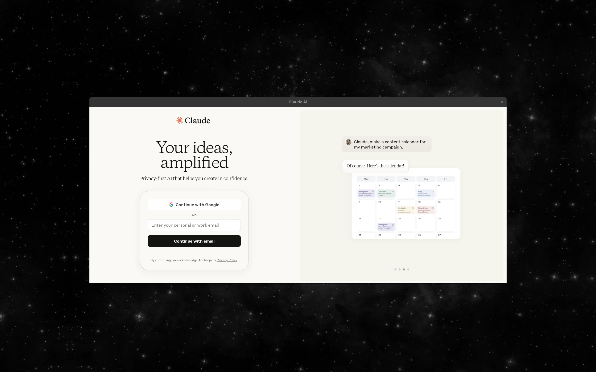

# 🪟 GNOME FloatPanes

Create persistent floating application panes for quick access to your favorite tools.


## 🔍 Overview

GNOME FloatPanes lets you launch applications in floating windows that can be toggled on/off while maintaining their state. These panes float above your workspace, enabling quick access to frequently used tools without disrupting your main workflow.

<p align="center">
  
</p>

## ✨ Features

- 📌 **Persistent Floating Windows**: Create floating windows that persist across toggling
- 🔄 **State Preservation**: Maintain application state when hidden
- 📐 **Position Memory**: Remember position, size, and z-order
- 📱 **Web Application Support**: Open web apps in dedicated floating windows
- ⚙️ **Configurable Settings**: Customize window size, position, and behavior
- ⌨️ **Keyboard Shortcuts**: Toggle panes quickly with customizable shortcuts
- 🔍 **Debug Mode**: Enable detailed logging for troubleshooting

## 🛠️ Installation

### From Source

```bash
# Clone the repository
git clone https://github.com/angelsen/gnome-floatpanes.git
cd gnome-floatpanes

# Install dependencies and build
make
make install

# Enable the extension
gnome-extensions enable floatpanes@angelsen.github.com
```

After installation, log out and log back in to use the extension in Wayland, or restart GNOME Shell with <kbd>Alt</kbd>+<kbd>F2</kbd>, type `r`, and press <kbd>Enter</kbd> (X11 only).

## 🖥️ Usage

1. **Create a new pane**: Click on the window icon in the top panel and select "New Pane" or a specific application
2. **Toggle panes**: Use the keyboard shortcut (<kbd>Super</kbd>+<kbd>Space</kbd> by default) or click on the panel icon
3. **Configure settings**: Right-click on the panel icon and select "Preferences" or use the GNOME Extensions app

### Default Keyboard Shortcuts

- **Toggle all panes**: <kbd>Super</kbd>+<kbd>Space</kbd> (customizable in settings)

## 🧪 Development

### Build Commands

```bash
# See all available commands
make help

# Common commands
make              # Build the extension
make install      # Install to local GNOME Shell
make uninstall    # Remove from GNOME Shell
make pack         # Create installable zip file
make typecheck    # Run TypeScript type checking
make dev          # Install and restart GNOME Shell (X11 only)
```

### Testing

Test in a nested GNOME Shell:

```bash
dbus-run-session -- gnome-shell --nested --wayland
```

Monitor logs:

```bash
journalctl -f -o cat /usr/bin/gnome-shell
```

Enable debug mode in the extension preferences for detailed logging.

## 📅 Roadmap

- [x] Project setup and TypeScript configuration
- [x] Basic window management (create, position, hide, show)
- [x] Panel indicator with dropdown menu
- [x] Persistence mechanism (remember window state)
- [x] WebKitGTK integration
- [x] Debug mode and structured logging
- [ ] Improve stability and compatibility
- [ ] Native GTK application support
- [ ] Pane stacking and advanced features

## 🤝 Contributing

Contributions are welcome! Please feel free to submit a Pull Request.

1. Fork the repository
2. Create your feature branch: `git checkout -b feature/my-new-feature`
3. Commit your changes: `git commit -am 'Add new feature'`
4. Push to the branch: `git push origin feature/my-new-feature`
5. Submit a pull request

## 📄 License

This project is licensed under the GPL-3.0 License - see the [LICENSE](LICENSE) file for details.